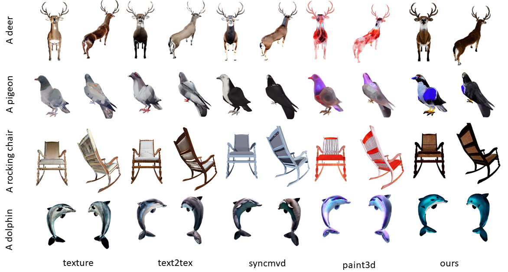

<h1 align="center">GaussianGrow: Geometry-aware Gaussian Growing from 3D Point Clouds with Text Guidance  
(CVPR 2026)</h1>

    <a href="https://weiqi-zhang.github.io/"><strong>Weiqi Zhang*</strong></a>
    &middot;
    <a href="https://junshengzhou.github.io/"><strong>Junsheng Zhou*&dagger;</strong></a>
    &middot;
    <a href="https://github.com/mts246/"><strong>Haotian Geng</strong></a>
    &middot;
    <strong>Kanle Shi</strong>
    &middot;
    <strong>Shenkun Xu</strong>
    &middot;
    <a href="https://engineering.nyu.edu/faculty/yi-fang"><strong>Yi Fang</strong></a>
    &middot;
    <a href="https://yushen-liu.github.io/"><strong>Yu-Shen Liu&dagger;</strong></a>

<strong>(* Equal Contribution &dagger; Corresponding Author)</strong>

    1School of Software, Tsinghua University &nbsp;&nbsp;
    2Kuaishou Technology &nbsp;&nbsp;
    3CAIR and CIDSAI, NYU Abu Dhabi

<h3 align="center"><a href="https://arxiv.org/abs/xxxx.xxxxx">Paper</a> | <a href="https://weiqi-zhang.github.io/GaussianGrow/">Project Page</a></h3>

    

## Generation Results

### Visual Comparison of Text-Guided Generation

### Point-to-Gaussian Generation

### Text-to-3D Generation

### More Visual Results

## Code

We are cleaning up the code and will release it soon. Stay tuned!

## Acknowledgements

This project is built upon [2DGS](https://github.com/hbb1/2d-gaussian-splatting) and [GAP](https://github.com/weiqi-zhang/GAP). We thank all the authors for their great repos.

## Citation

If you find our code or paper useful, please consider citing

    @inproceedings{gaussiangrow,
          title={GaussianGrow: Geometry-aware Gaussian Growing from 3D Point Clouds with Text Guidance},
          author={Zhang, Weiqi and Zhou, Junsheng and Geng, Haotian and Shi, Kanle and Xu, Shenkun and Fang, Yi and Liu, Yu-Shen},
          booktitle={Proceedings of the IEEE/CVF Conference on Computer Vision and Pattern Recognition (CVPR)},
          year={2026}
        }
