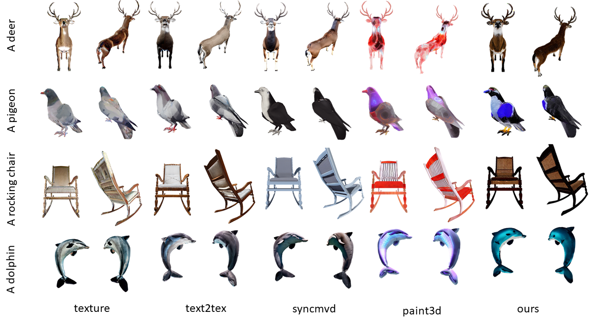

<p align="center">
<h1 align="center">GaussianGrow: Geometry-aware Gaussian Growing from 3D Point Clouds with Text Guidance <br>
(CVPR 2026)</h1>
<p align="center">
    <a href="https://weiqi-zhang.github.io/"><strong>Weiqi Zhang*</strong></a>
    &middot;
    <a href="https://junshengzhou.github.io/"><strong>Junsheng Zhou*&dagger;</strong></a>
    &middot;
    <a href="https://github.com/mts246/"><strong>Haotian Geng</strong></a>
    &middot;
    <strong>Kanle Shi</strong>
    &middot;
    <strong>Shenkun Xu</strong>
    &middot;
    <a href="https://engineering.nyu.edu/faculty/yi-fang"><strong>Yi Fang</strong></a>
    &middot;
    <a href="https://yushen-liu.github.io/"><strong>Yu-Shen Liu&dagger;</strong></a>
</p>
<p align="center"><strong>(* Equal Contribution &dagger; Corresponding Author)</strong></p>
<p align="center">
    <sup>1</sup>School of Software, Tsinghua University &nbsp;&nbsp;
    <sup>2</sup>Kuaishou Technology &nbsp;&nbsp;
    <sup>3</sup>CAIR and CIDSAI, NYU Abu Dhabi
</p>
<h3 align="center"><a href="http://arxiv.org/abs/2604.05721">Paper</a> | <a href="https://weiqi-zhang.github.io/GaussianGrow/">Project Page</a></h3>
<div align="center"></div>
</p>
<p align="center">
    
</p>

## Generation Results

### Visual Comparison of Text-Guided Generation


### Point-to-Gaussian Generation


### Text-to-3D Generation


### More Visual Results



## Code

The runnable GaussianGrow release is now included in this repository. The code release keeps the main pipeline, a small example mesh, and required local CUDA extension sources, while excluding model weights, generated outputs, videos, caches, conda packages, and compiled binaries.

### Repository Layout

```text
.
├── scripts/                    # Pipeline entrypoints and mesh utilities
├── gaussian_grow/              # GaussianGrow package code
├── scene/, utils/, arguments/   # 3D Gaussian Splatting support code
├── gaussian_renderer/          # Gaussian renderer wrapper
├── Hunyuan3D/                  # Minimal Hunyuan3D texture wrapper and hy3dgen code
├── models/ControlNet/          # ControlNet code, without model weights
├── models/delight/             # Optional Hunyuan3D delight helper
├── extensions/                 # Local CUDA extensions
└── examples/fire_dragon/       # Small example input mesh
```

### Environment

Use Python 3.9 with a CUDA-enabled PyTorch build. Install PyTorch and PyTorch3D first using versions compatible with your GPU/CUDA driver, then install the Python dependencies:

```bash
pip install -r requirements.txt
pip install -e .
```

Install the local CUDA extensions:

```bash
scripts/install_extensions.sh
```

This installs the three local extensions used by the release pipeline:
`depthid_render`, `depthid_render_mask_control_v2`, and `find_max_in_circles`.
The Hunyuan3D texture stage also installs its bundled `custom_rasterizer`.

Install the remaining Gaussian rasterization dependencies:

```bash
git clone --recursive https://github.com/hbb1/diff-surfel-rasterization.git third_party/diff-surfel-rasterization
pip install -e third_party/diff-surfel-rasterization

git clone --recursive https://github.com/graphdeco-inria/gaussian-splatting.git third_party/gaussian-splatting
pip install -e third_party/gaussian-splatting/submodules/simple-knn
```

Check the environment before launching the full pipeline:

```bash
python scripts/check_setup.py
```

### Required Assets

This repository does not ship model weights. Set these paths before running:

```bash
export CAPUDF_ROOT=/path/to/CAP-UDF
export HUNYUAN3D_MODEL_PATH=/path/to/Hunyuan3D-2
export HUNYUAN3D_DELIGHT_MODEL_PATH=/path/to/Hunyuan3D-2/hunyuan3d-delight-v2-0
export CONTROLNET_DEPTH_CKPT=/path/to/control_sd15_depth.pth
```

Download `control_sd15_depth.pth` from the ControlNet model release. Either set `CONTROLNET_DEPTH_CKPT` to the checkpoint path or place it at:

```text
models/ControlNet/models/control_sd15_depth.pth
```

`HUNYUAN3D_DELIGHT_MODEL_PATH` is optional. If it is not set, the final refinement runs without the delight model unless `HUNYUAN3D_MODEL_PATH/hunyuan3d-delight-v2-0` exists.

### Run The Pipeline

The default example uses `examples/fire_dragon/dragon_normalized.obj`:

```bash
CUDA_VISIBLE_DEVICES=0 scripts/run_gaussian_grow.sh
```

`scripts/run_gaussian_grow.sh` runs the same preflight check by default. Set `SKIP_PREFLIGHT=1` only when you have already checked the environment and want to skip this guard.

Override the input and prompt with environment variables:

```bash
INPUT_DIR=/path/to/mesh_dir \
OBJ_NAME=my_mesh_normalized \
OBJ_FILE=my_mesh_normalized.obj \
OUTPUT_DIR=outputs/my_mesh \
PROMPT="A stylized ceramic fox with blue floral patterns" \
CUDA_VISIBLE_DEVICES=0 \
scripts/run_gaussian_grow.sh
```

The pipeline runs four stages, which correspond to the two-stage method in the paper:

1. `scripts/stage1_initialize_gaussians.py` — initialise 2D Gaussians from the input point cloud and fit a CAP-UDF field (paper §3.1 Preliminary Preparation, plus the geometric maps in §3.2).
2. `scripts/stage2_generate_main_view.py` — synthesise the reference (primary) appearance via Depth-Aware ControlNet + Stable Diffusion (paper §3.2 Multi-view Image Generation, primary view).
3. `scripts/stage3_texture_mesh.py` — run the Hunyuan3D-Paint multi-view diffusion model and write the K=10 view images plus `azim.json` / `elev.json` (paper §3.2 cardinal + additional views).
4. `scripts/stage4_refine_gaussians.py` — optimise Gaussians per view, refine the overlap regions, and iteratively inpaint the unseen regions (paper §3.3 Iterative Gaussian Inpainting + Spatial Inpainting).

Outputs are written to `OUTPUT_DIR`; the final Gaussian splat is `OUTPUT_DIR/update/gaussian/final.ply`.

### Hardware Notes

The pipeline assumes a single CUDA GPU. Stage scripts auto-tune their render resolution based on `--device`:

- `--device a6000` (default): high resolution (1024×1024, `uv_size=3000`), recommended on a ≥48 GB GPU.
- `--device 2080`: low-resolution profile (`uv_size=1000`) for limited-VRAM setups.

The Hunyuan3D texture stage alone needs roughly 24 GB of VRAM, and Stable Diffusion + ControlNet in stages 2 and 4 add another 10 GB or so.


## Acknowledgements

GaussianGrow builds on a number of open research projects. We thank the authors of:

- [2D Gaussian Splatting (2DGS)](https://github.com/hbb1/2d-gaussian-splatting) and [3D Gaussian Splatting](https://github.com/graphdeco-inria/gaussian-splatting) — Gaussian representation and rasterisation.
- [CAP-UDF](https://github.com/junshengzhou/CAP-UDF) — unsigned distance field learning for raw point clouds.
- [Hunyuan3D-2](https://github.com/Tencent/Hunyuan3D-2) — multi-view diffusion model used for appearance synthesis.
- [ControlNet](https://github.com/lllyasviel/ControlNet) and [Stable Diffusion](https://github.com/Stability-AI/stablediffusion) — depth-aware reference view generation and inpainting.
- [TexTure](https://github.com/TEXTurePaper/TEXTurePaper) and [GAP](https://github.com/weiqi-zhang/GAP) — earlier text-guided texturing pipelines that inspired the view-driven optimisation loop.

See `THIRD_PARTY.md` for the full bundled-component and license map.


## Citation

If you find our code or paper useful, please consider citing

    @inproceedings{gaussiangrow,
          title={GaussianGrow: Geometry-aware Gaussian Growing from 3D Point Clouds with Text Guidance},
          author={Zhang, Weiqi and Zhou, Junsheng and Geng, Haotian and Shi, Kanle and Xu, Shenkun and Fang, Yi and Liu, Yu-Shen},
          booktitle={Proceedings of the IEEE/CVF Conference on Computer Vision and Pattern Recognition (CVPR)},
          year={2026}
        }
